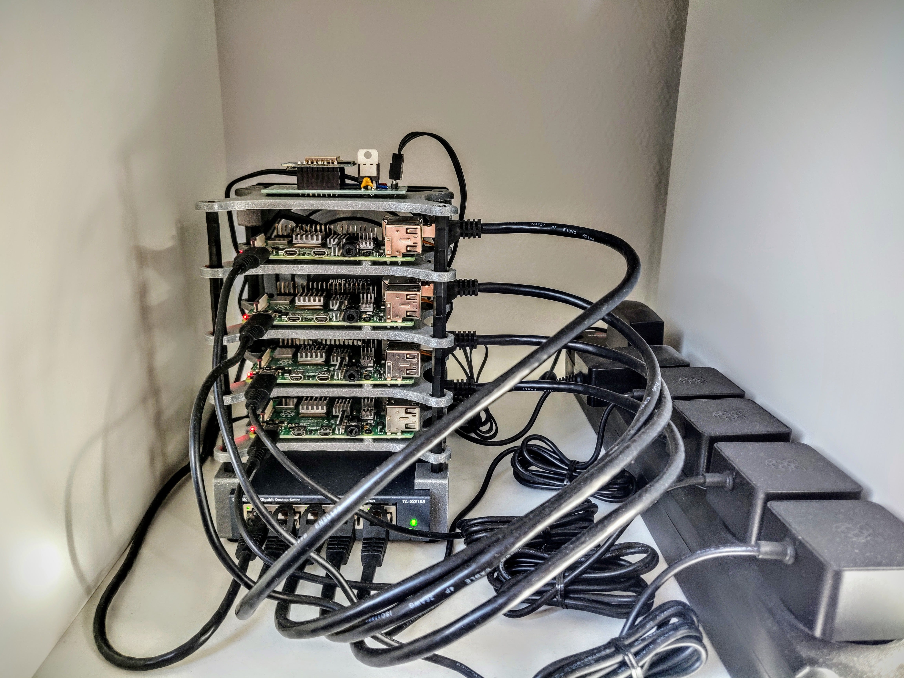

# :rocket:&nbsp; k3s cluster at :house:

This repository is dedicated to my personal [k3s](https://k3s.io/) cluster deployed with [k3sup](https://github.com/alexellis/k3sup) backed by [Flux](https://toolkit.fluxcd.io/), [SOPS](https://toolkit.fluxcd.io/guides/mozilla-sops/) and maintained by [Renovate](https://github.com/renovatebot/renovate).



## :package:&nbsp; Components

- [flannel](https://github.com/flannel-io/flannel) - default CNI provided by k3s
- [local-path-provisioner](https://github.com/rancher/local-path-provisioner) - default storage class provided by k3s
- [flux](https://toolkit.fluxcd.io/) - GitOps tool for deploying manifests from the `cluster` directory
- [metallb](https://metallb.universe.tf/) - bare metal load balancer
- [cert-manager](https://cert-manager.io/) - SSL certificates - with Cloudflare DNS challenge
- [traefik](https://traefik.io) - ingress controller
- [system-upgrade-controller](https://github.com/rancher/system-upgrade-controller) - upgrade k3s
- [nfs-subdir-external-provisioner](https://github.com/kubernetes-sigs/nfs-subdir-external-provisioner) - external cluster storage
- [Prometheus](https://github.com/prometheus/prometheus) - cluster monitoring
- [Loki](https://github.com/grafana/loki) - log management
- [Grafana]() - visualization for cluster monitoring and log management

## :memo:&nbsp; Prerequisites

### :computer:&nbsp; Nodes

- Enable packet forwarding on the hosts and increase `max_user_watches`

```sh
cat <<EOF | sudo tee /etc/sysctl.d/k8s.conf
net.bridge.bridge-nf-call-iptables = 1
net.ipv4.ip_forward=1
fs.inotify.max_user_watches=65536
EOF
sysctl --system
```

- Configure DNS on nodes to use an upstream provider (e.g. `1.1.1.1`, `9.9.9.9`), or router's IP (Ad-blockers should only be used on devices with a web browser) and set a static IP with `/etc/dhcpcd.conf` file.

- Disable **swap** with `sudo dphys-swapfile swapoff && sudo dphys-swapfile uninstall && sudo update-rc.d dphys-swapfile remove && sudo rm -f /etc/init.d/dphys-swapfile && sudo service dphys-swapfile stop && sudo systemctl disable dphys-swapfile.service`

- Install [log2ram](https://github.com/azlux/log2ram) and configure `/etc/log2ram.conf` with `SIZE=100M`. Add rule `size 60M` to `/etc/logrotate.d/log2ram`.

- Disable **syslog** to reduce pressure on SD card

```sh
sudo service rsyslog stop
sudo systemctl disable rsyslog
```

- Configure **logrotate** for all logs with `/etc/logrotate.conf`

```sh
# use daily rotation
daily

# keep 3 days worth of backlogs
rotate 3

copytruncate
```

- Disable leds all on Raspberry Pi with `/boot/config.txt`

```sh
[pi4]
# Disable the PWR LED
dtparam=pwr_led_trigger=none
dtparam=pwr_led_activelow=off
# Disable the Activity LED
dtparam=act_led_trigger=none
dtparam=act_led_activelow=off
# Disable ethernet port LEDs
dtparam=eth_led0=4
dtparam=eth_led1=4
```

### :wrench:&nbsp; Tools

:round_pushpin: CLI tools required on workstation.

| Tool                                                               | Purpose                                                             |
|--------------------------------------------------------------------|---------------------------------------------------------------------|
| [k3sup](https://github.com/alexellis/k3sup)                        | Tool to install k3s on your nodes                                   |
| [kubectl](https://kubernetes.io/docs/tasks/tools/)                 | Allows you to run commands against Kubernetes clusters              |
| [flux](https://toolkit.fluxcd.io/)                                 | Operator that manages your k8s cluster based on your Git repository |
| [SOPS](https://github.com/mozilla/sops)                            | Encrypts k8s secrets with GnuPG                                     |
| [GnuPG](https://gnupg.org/)                                        | Encrypts and signs your data                                        |
| [pinentry](https://gnupg.org/related_software/pinentry/index.html) | Allows GnuPG to read passphrases and PIN numbers                    |
| [direnv](https://github.com/direnv/direnv)                         | Exports env vars based on present working directory                 |
| [pre-commit](https://github.com/pre-commit/pre-commit)             | Runs checks pre `git commit`                                     |
| [kustomize](https://kustomize.io/)                                 | Template-free way to customize application configuration            |
| [helm](https://helm.sh/)                                           | Manage Kubernetes applications                                      |
| [go-task](https://github.com/go-task/task)                         | A task runner / simpler Make alternative written in Go              |
| [prettier](https://github.com/prettier/prettier)                   | Prettier is an opinionated code formatter.                          |

### :warning:&nbsp; pre-commit

[sops-pre-commit](https://github.com/k8s-at-home/sops-pre-commit) will check to make sure we are not by accident commiting secrets un-encrypted.

After pre-commit is installed :

```sh
pre-commit install-hooks
```

## :open_file_folder:&nbsp; Repository structure

The Git repository contains the following directories under `cluster` and are ordered below by how Flux will apply them.

- **base** directory is the entrypoint to Flux
- **crds** directory contains custom resource definitions (CRDs) that need to exist globally in your cluster before anything else exists
- **core** directory (depends on **crds**) are important infrastructure applications (grouped by namespace) that should never be pruned by Flux
- **apps** directory (depends on **core**) is where applications (grouped by namespace) are placed. Flux will prune resources here if they are not tracked by Git anymore.

```
cluster
├── apps
│   ├── default
│   ├── home-assistant
│   ├── mosquitto
│   ├── networking
│   ├── system-upgrade
│   ├── unifi
│   └── vaultwarden
├── base
│   └── flux-system
├── core
│   ├── cert-manager
│   ├── log-management
│   ├── metallb-system
│   ├── monitoring
│   ├── monitoring-config
│   ├── namespaces
│   ├── nfs-provisioner
│   └── system-upgrade
└── crds
    └── cert-manager
```

## :rocket:&nbsp; Deployment

### :closed_lock_with_key:&nbsp; Setting up GnuPG keys

:round_pushpin: SOPS with GnuPG permits to encrypt and decrypt secrets.

1. Creation of a Personal GPG Key, password protected, and export of the fingerprint.

```sh
export GPG_TTY=$(tty)
export PERSONAL_KEY_NAME="First name Last name (location) <email>"

gpg --batch --full-generate-key <<EOF
Key-Type: 1
Key-Length: 4096
Subkey-Type: 1
Subkey-Length: 4096
Expire-Date: 0
Name-Real: ${PERSONAL_KEY_NAME}
EOF

gpg --list-secret-keys "${PERSONAL_KEY_NAME}"
# pub   rsa4096 2021-03-11 [SC]
#       772154FFF783DE317KLCA0EC77149AC618D75581
# uid           [ultimate] k8s@home (Macbook) <k8s-at-home@gmail.com>
# sub   rsa4096 2021-03-11 [E]

export PERSONAL_KEY_FP=772154FFF783DE317KLCA0EC77149AC618D75581
```

2. Creation of a Flux GPG Key and export of the fingerprint

```sh
export GPG_TTY=$(tty)
export FLUX_KEY_NAME="Cluster name (Flux) <email>"

gpg --batch --full-generate-key <<EOF
%no-protection
Key-Type: 1
Key-Length: 4096
Subkey-Type: 1
Subkey-Length: 4096
Expire-Date: 0
Name-Real: ${FLUX_KEY_NAME}
EOF

gpg --list-secret-keys "${FLUX_KEY_NAME}"
# pub   rsa4096 2021-03-11 [SC]
#       AB675CE4CC64251G3S9AE1DAA88ARRTY2C009E2D
# uid           [ultimate] Home cluster (Flux) <k8s-at-home@gmail.com>
# sub   rsa4096 2021-03-11 [E]

export FLUX_KEY_FP=AB675CE4CC64251G3S9AE1DAA88ARRTY2C009E2D
```

### :sailboat:&nbsp; Installing k3s

1. Installation of the master node

_Servicelb is replaced by metallb, traefik and metrics-server will be installed with Flux._

```sh
curl -sfL https://get.k3s.io | \
INSTALL_K3S_VERSION=v1.21.4+k3s1 sh -s - server \
--node-taint CriticalAddonsOnly=true:NoExecute \
--disable servicelb \
--disable traefik \
--disable metrics-server \
--tls-san <master-ip> \
--datastore-endpoint="postgres://<user>:<password>@<ip>:<port>/<db>?sslmode=disable"
```

2. Join worker nodes

```sh
curl -sfL https://get.k3s.io | \
INSTALL_K3S_VERSION=v1.21.4+k3s1 \
K3S_TOKEN=<token>  \
K3S_URL=https://<master-ip>:6443 sh -
```

3. Check nodes are online
   
```sh
kubectl get nodes
# NAME         STATUS   ROLES                  AGE   VERSION
# k3s-master   Ready    control-plane,master   46d   v1.21.4+k3s1
# k3s-node-3   Ready    <none>                 46d   v1.21.4+k3s1
# k3s-node-2   Ready    <none>                 46d   v1.21.4+k3s1
# k3s-node-1   Ready    <none>                 46d   v1.21.4+k3s1
```

### :small_blue_diamond:&nbsp; GitOps with Flux

1. Verify Flux can be installed

```sh
flux --kubeconfig=./kubeconfig check --pre
# ► checking prerequisites
# ✔ kubectl 1.21.4 >=1.18.0-0
# ✔ Kubernetes 1.21.4+k3s1 >=1.16.0-0
# ✔ prerequisites checks passed
```

2. Pre-create the `flux-system` namespace

```sh
kubectl create namespace flux-system --dry-run=client -o yaml | kubectl apply -f -
```

3. Add the Flux GPG key in-order for Flux to decrypt SOPS secrets

```sh
gpg --export-secret-keys --armor "${FLUX_KEY_FP}" |
kubectl --kubeconfig=./kubeconfig create secret generic sops-gpg \
    --namespace=flux-system \
    --from-file=sops.asc=/dev/stdin
```

4. Export more environment variables for application configuration

```sh
source .env
```

5. Create required files based on ALL exported environment variables.

```sh
envsubst < ./tmpl/.sops.yaml > ./.sops.yaml
envsubst < ./tmpl/cluster-secrets.sops.yaml > ./cluster/base/cluster-secrets.sops.yaml
envsubst < ./tmpl/cluster-settings.yaml > ./cluster/base/cluster-settings.yaml
envsubst < ./tmpl/gotk-sync.yaml > ./cluster/base/flux-system/gotk-sync.yaml
envsubst < ./tmpl/secret.sops.yaml > ./cluster/core/cert-manager/secret.sops.yaml
```

6. **Verify** all the above files have the correct information present

7. Encrypt `cluster/cluster-secrets.sops.yaml` and `cert-manager/secret.sops.yaml` with SOPS

```sh
export GPG_TTY=$(tty)
sops --encrypt --in-place ./cluster/base/cluster-secrets.sops.yaml
sops --encrypt --in-place ./cluster/core/cert-manager/secret.sops.yaml
```

:round_pushpin: Variables defined in `cluster-secrets.sops.yaml` and `cluster-settings.sops.yaml` will be usable anywhere in your YAML manifests under `./cluster`

8. **Verify** all the above files are **encrypted** with SOPS

9. Push you changes to git

```sh
git add -A
git commit -m "initial commit"
git push
```

10. Install Flux

:round_pushpin: Due to race conditions with the Flux CRDs this command needs to be run twice. There should be no errors on this second run.

```sh
kubectl apply --kustomize=./cluster/base/flux-system
# namespace/flux-system configured
# customresourcedefinition.apiextensions.k8s.io/alerts.notification.toolkit.fluxcd.io created
# ...
# unable to recognize "./cluster/base/flux-system": no matches for kind "Kustomization" in version "kustomize.toolkit.fluxcd.io/v1beta1"
# unable to recognize "./cluster/base/flux-system": no matches for kind "GitRepository" in version "source.toolkit.fluxcd.io/v1beta1"
# unable to recognize "./cluster/base/flux-system": no matches for kind "HelmRepository" in version "source.toolkit.fluxcd.io/v1beta1"
# unable to recognize "./cluster/base/flux-system": no matches for kind "HelmRepository" in version "source.toolkit.fluxcd.io/v1beta1"
# unable to recognize "./cluster/base/flux-system": no matches for kind "HelmRepository" in version "source.toolkit.fluxcd.io/v1beta1"
# unable to recognize "./cluster/base/flux-system": no matches for kind "HelmRepository" in version "source.toolkit.fluxcd.io/v1beta1"
```

## :mega:&nbsp; Post installation

### Verify Flux

```sh
kubectl get pods -n flux-system
# NAME                                       READY   STATUS    RESTARTS   AGE
# helm-controller-5bbd94c75-89sb4            1/1     Running   0          1h
# kustomize-controller-7b67b6b77d-nqc67      1/1     Running   0          1h
# notification-controller-7c46575844-k4bvr   1/1     Running   0          1h
# source-controller-7d6875bcb4-zqw9f         1/1     Running   0          1h
```

### VSCode SOPS extension

[VSCode SOPS](https://marketplace.visualstudio.com/items?itemName=signageos.signageos-vscode-sops) is a neat little plugin for those using VSCode.
It will automatically decrypt SOPS secrets when the file is open in the editor and encrypt them when save and exit the file.

### :point_right:&nbsp; Debugging

Manually sync Flux with your Git repository

```sh
flux reconcile source git flux-system
# ► annotating GitRepository flux-system in flux-system namespace
# ✔ GitRepository annotated
# ◎ waiting for GitRepository reconciliation
# ✔ GitRepository reconciliation completed
# ✔ fetched revision main/943e4126e74b273ff603aedab89beb7e36be4998
```

Show the health of you kustomizations

```sh
kubectl get kustomization -A
# NAMESPACE     NAME          READY   STATUS                                                             AGE
# flux-system   apps          True    Applied revision: main/943e4126e74b273ff603aedab89beb7e36be4998    3d19h
# flux-system   core          True    Applied revision: main/943e4126e74b273ff603aedab89beb7e36be4998    4d6h
# flux-system   crds          True    Applied revision: main/943e4126e74b273ff603aedab89beb7e36be4998    4d6h
# flux-system   flux-system   True    Applied revision: main/943e4126e74b273ff603aedab89beb7e36be4998    4d6h
```

Show the health of your main Flux `GitRepository`

```sh
flux get sources git
# NAME           READY	MESSAGE                                                            REVISION                                         SUSPENDED
# flux-system    True 	Fetched revision: main/943e4126e74b273ff603aedab89beb7e36be4998    main/943e4126e74b273ff603aedab89beb7e36be4998    False
```

Show the health of your `HelmRelease`s

```sh
flux get helmrelease -A
# NAMESPACE   	    NAME                  	READY	MESSAGE                         	REVISION	SUSPENDED
# cert-manager	    cert-manager          	True 	Release reconciliation succeeded	v1.5.2  	False
# default        	hajimari                True 	Release reconciliation succeeded	1.1.1   	False
# networking  	    ingress-nginx       	True 	Release reconciliation succeeded	3.30.0  	False
```

Show the health of your `HelmRepository`s

```sh
flux get sources helm -A
# NAMESPACE  	NAME                 READY	MESSAGE                                                   	REVISION                                	SUSPENDED
# flux-system	bitnami-charts       True 	Fetched revision: 0ec3a3335ff991c45735866feb1c0830c4ed85cf	0ec3a3335ff991c45735866feb1c0830c4ed85cf	False
# flux-system	hajimari-charts      True 	Fetched revision: 1b24af9c5a1e3da91618d597f58f46a57c70dc13	1b24af9c5a1e3da91618d597f58f46a57c70dc13	False
# flux-system	ingress-nginx-charts True 	Fetched revision: 45669a3117fc93acc09a00e9fb9b4445e8990722	45669a3117fc93acc09a00e9fb9b4445e8990722	False
# flux-system	jetstack-charts      True 	Fetched revision: 7bad937cc82a012c9ee7d7a472d7bd66b48dc471	7bad937cc82a012c9ee7d7a472d7bd66b48dc471	False
# flux-system	k8s-at-home-charts   True 	Fetched revision: 1b24af9c5a1e3da91618d597f58f46a57c70dc13	1b24af9c5a1e3da91618d597f58f46a57c70dc13	False
```

### :robot:&nbsp; Automation

- [Renovate](https://www.whitesourcesoftware.com/free-developer-tools/renovate) is a very useful tool that create PRs in this Github repository when Docker images, Helm charts or anything else that can be tracked has a newer version. The configuration for renovate is located [here](./.github/renovate.json5).

- [system-upgrade-controller](https://github.com/rancher/system-upgrade-controller)  watch for new k3s releases and upgrade your nodes when new releases are found.

A couple of Github workflows included in this repository help automate some processes.

- [Flux upgrade schedule](./.github/workflows/flux-schedule.yaml) - workflow to upgrade Flux.
- [Renovate schedule](./.github/workflows/renovate-schedule.yaml) - workflow to annotate `HelmRelease`'s which allows [Renovate](https://www.whitesourcesoftware.com/free-developer-tools/renovate) to track Helm chart versions.
